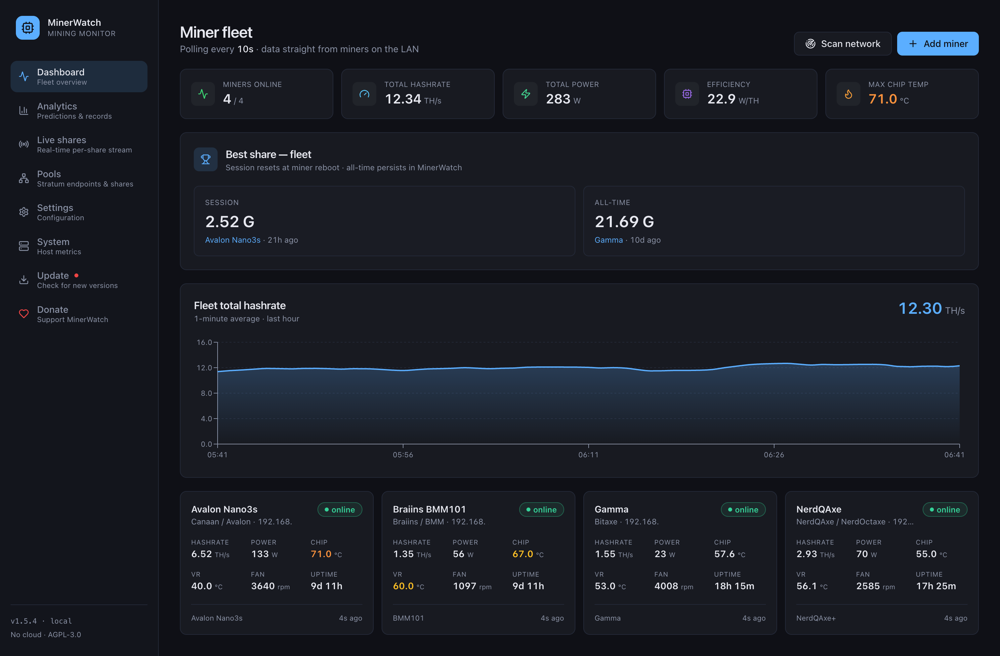
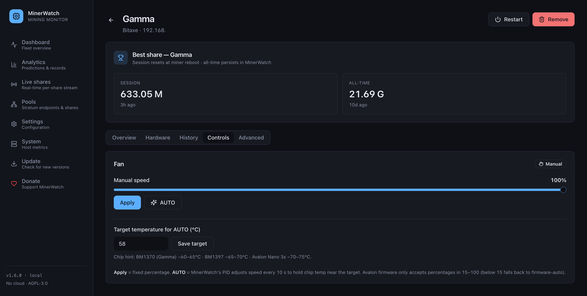
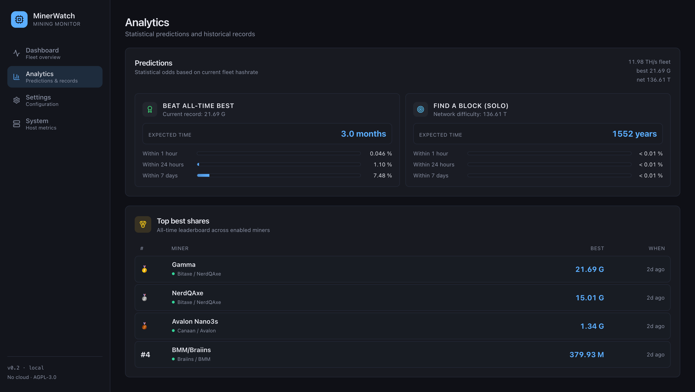
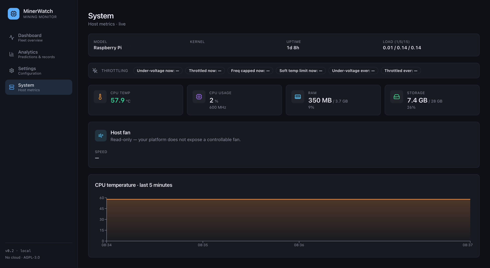

<div align="center">

# MinerWatch

**A local-first dashboard for home Bitcoin miners.**

Monitor and control Bitaxe, NerdQAxe, Canaan Avalon Nano 3s and Braiins BMM
miners on your home network — all from your browser, no cloud, no telemetry.

[](https://github.com/imlenti/MinerWatch/actions/workflows/ci.yml)
[](LICENSE)
[](https://www.python.org/)
[](#)
[](#disclaimer)
[](CONTRIBUTING.md)

⚡ If MinerWatch is useful to your home rig, donations are welcome — BTC only:
`bc1qexhamvrpclpr2skyyw3u8edm8kznnvt6zjudxu`



</div>

## Screenshots

<table>
  <tr>
    <td align="center">
      <strong>Dashboard</strong><br/>
      <sub>Fleet overview · live miner cards · hashrate chart</sub><br/>
      <!-- Replace docs/screenshots/dashboard.png with a fresh 1280×800 capture of / -->
      
    </td>
    <td align="center">
      <strong>Miner controls</strong><br/>
      <sub>Per-device Controls tab · fan slider · AUTO PID</sub><br/>
      <!-- Capture /miner/&lt;id&gt; with the Controls tab open and save as docs/screenshots/miner-controls.png -->
      
    </td>
  </tr>
  <tr>
    <td align="center">
      <strong>Analytics</strong><br/>
      <sub>Beat-best & find-block predictions · top best shares</sub><br/>
      <!-- Capture /analytics and save as docs/screenshots/analytics.png -->
      
    </td>
    <td align="center">
      <strong>System</strong><br/>
      <sub>Raspberry Pi host metrics · throttling · CPU temp</sub><br/>
      <!-- Capture /system on the Pi and save as docs/screenshots/system.png -->
      
    </td>
  </tr>
</table>


---

## What it is

MinerWatch is a small Python web app you run on your own machine (a Mac, a
Linux box, or a Raspberry Pi) on the same LAN as your miners. It polls each
device every few seconds, stores hash rate, temperature, power, fan and pool
data in a local SQLite database, and gives you a browser dashboard that
works from your phone, tablet, or laptop.

It is meant for **home / small-scale mining setups** (1–10 miners), users
comfortable opening a terminal but not necessarily developers.

## Features

- **Live dashboard** — hash rate, chip and VR temps, fans, power, efficiency
  (W/TH), accepted / rejected shares and uptime for every miner at a glance,
  refreshed every 5 seconds by default
- **Per-miner detail page** with tabs (Overview · Hardware · History ·
  Controls), Chart.js graphs over the last hour / day / week / month, and a
  grouped hardware view (Identity, ASIC, Thermal, Fan & Power, Pool)
- **Predictions widget** — probability of beating your all-time best share
  and (when stratum exposes the network difficulty) of finding a block, at
  1 h / 24 h / 7 d, computed with the Poisson model for solo-mining shares
- **Top best shares leaderboard** across enabled miners, with medals and a
  link to the device
- **Best-share tracker** — session and all-time best difficulty per miner
  and across the fleet, with native push when a miner breaks its own
  all-time record
- **Block-find detection** — when a share difficulty meets or exceeds the
  network difficulty (a solo block!), MinerWatch fires a push notification
  and pins a permanent trophy card on the dashboard
- **Server-side auto-fan PID** controller (`backend/auto_control.py`)
  replicating the BitAxe firmware loop (Kp=5, Ki=0.1, Kd=2, EMA, target temp
  configurable per device). Useful on miners whose firmware lacks a sane
  curve, or to hold a target temperature across the fleet
- **Multi-channel alerts**: Web Push (VAPID) for native OS notifications,
  *and* a Telegram bot that delivers to any phone or desktop without HTTPS
  — both channels are independent kill-switches in the UI
- **Tiered metric retention** — raw 5-second samples for the last 48 h,
  1-minute rollups for 30 days, 1-hour rollups for 2 years. SQLite stays
  small, history stays long
- **LAN auto-discovery** of miners on demand (port 80 for Bitaxe-class,
  port 4028 for cgminer-based devices), with MAC-pinned identity so DHCP
  IP changes don't break tracking
- **Optional password protection** (bearer-token + cookie) for setups where
  the LAN isn't fully trusted
- **Modern dark UI** — React 18 + TypeScript + Tailwind CSS + Shadcn primitives
  + Recharts, served as a single-page app. Sidebar nav, tabbed device detail,
  responsive down to phone-size viewports
- **One-click macOS launcher**, Docker setup for Linux / Raspberry Pi, and
  an Umbrel App Store package (`umbrel/`) for one-click install on umbrelOS
- **No cloud, no account, no analytics** — all data stays on your box

## Supported miners

| Family          | Tested models                            | Protocol                |
|-----------------|------------------------------------------|-------------------------|
| Bitaxe          | Gamma 601 / 602, Supra, Ultra, Max       | HTTP REST :80           |
| NerdQAxe        | NerdQAxe+, NerdQAxe++                    | HTTP REST :80 (Bitaxe-compatible) |
| Canaan Avalon   | Nano 3s, Avalon Q                        | TCP cgminer-text :4028  |
| Braiins         | BMM 101 (BOSminer firmware)              | TCP cgminer-JSON :4028  |

Adding a new model usually means a single new file in `backend/miners/`.
See [CONTRIBUTING.md](CONTRIBUTING.md) for the driver template.

## Quick start

### macOS / Linux (one-line)

```bash
git clone https://github.com/imlenti/MinerWatch.git
cd MinerWatch

# Build the React frontend once. Requires Node ≥ 18.
# macOS:    brew install node
# Raspbian: curl -fsSL https://deb.nodesource.com/setup_20.x | sudo -E bash - \
#           && sudo apt-get install -y nodejs
cd frontend-react && npm install && npm run build && cd ..

chmod +x start.sh
./start.sh
```

`start.sh` creates a Python virtualenv in `.venv/`, installs deps,
initialises the SQLite database in `data/`, and starts the FastAPI
server with auto-reload. The React bundle you just built is served
out of `frontend-react/dist/`.

Then open:

- From the same machine: <http://localhost:8000>
- From any phone / tablet / PC on the same LAN: `http://<host-ip>:8000`

Stop with `Ctrl+C`, or `./stop.sh` if it was launched in the background.

> Prefer not to install Node? Use the Docker flow below — its
> `frontend-builder` stage runs `npm install && npm run build` inside
> the image, so the host only needs Docker.

### macOS one-click (recommended for non-developers)

Double-click `installer.command` from Finder. It will:

1. Copy MinerWatch into `~/Library/Application Support/MinerWatch/`.
2. Create the Python virtualenv there and install dependencies.
3. Register a **LaunchAgent** so MinerWatch starts automatically every
   time you log in, and restarts itself if it ever crashes.
4. Open the dashboard at `http://localhost:8000` in your browser.

The installer works no matter where you keep the source folder — Desktop,
Documents, Downloads, iCloud Drive, an external volume, anywhere. macOS
Privacy (TCC) blocks background launchd jobs from reading those locations,
so MinerWatch installs the running copy under `~/Library/Application
Support` (always accessible) and runs from there. After install, you can
move or delete the source folder; the service keeps running.

To update after editing the source: just double-click `installer.command`
again — it re-syncs the runtime copy.

To stop the auto-start, double-click `uninstaller.command`. It will offer
to wipe the runtime directory too (database + logs); answer `n` to keep
your data.

### Run as a service (auto-start at login / boot)

If you skipped the one-click installer, you can register the service
manually. The same script handles both macOS (launchd) and Linux (systemd):

```bash
./scripts/install-service.sh           # install + start
./scripts/install-service.sh --status  # show current state
./scripts/uninstall-service.sh         # remove
```

On **macOS** this installs a user-level LaunchAgent at
`~/Library/LaunchAgents/com.imlenti.minerwatch.plist`. Logs land in
`data/logs/minerwatch.{out,err}.log`.

On **Linux / Raspberry Pi** it installs a systemd user unit at
`~/.config/systemd/user/minerwatch.service`. Tail the logs with
`journalctl --user -u minerwatch -f`. To start MinerWatch at boot even
without an interactive login (typical headless Pi setup), enable lingering:

```bash
sudo loginctl enable-linger $USER
```

### Docker / Raspberry Pi (alternative to start.sh)

A multi-stage `Dockerfile` and a `docker-compose.yml` are shipped for
users who prefer containers. **It's an alternative, not a requirement**:
on Linux (including Raspberry Pi) `start.sh` and `scripts/install-service.sh`
work just as well, with less overhead.

```bash
docker compose up -d --build
```

First build takes 1–3 minutes (downloads the Python image and resolves
the dependency tree); subsequent restarts are instant.

What the stack does:

- Builds a Python 3.11-slim image, multi-stage, runs as a non-root
  `minerwatch` user (UID 1000), no compilers in the final layer.
- Mounts `./data` from the repo into `/app/data` so SQLite, VAPID
  keys, push subscriptions and logs survive `docker compose down`.
- Uses `network_mode: host` so MinerWatch can reach miners on the
  same LAN as the host — required for auto-discovery and polling.
- Adds a `HEALTHCHECK` on `/api/health` so `docker ps` reflects
  whether the API is actually serving.

Update after a `git pull`:

```bash
docker compose up -d --build
```

Stop:

```bash
docker compose down
```

Wipe runtime data too (database, VAPID keys, push subscriptions —
will reset everything as if newly installed):

```bash
docker compose down
rm -rf data
```

### Umbrel App Store

If you run an Umbrel home server, MinerWatch ships an App Store package
under `umbrel/` (`umbrel-app.yml` + `docker-compose.yml` + README). The
submission process is the standard `getumbrel/umbrel-apps` PR flow —
the `umbrel/README.md` documents the build / pin / publish checklist.
Once the listing is approved, installation is a single click from the
Umbrel dashboard, and persistent data lives in `${APP_DATA_DIR}/data`
on the Umbrel box.

#### Caveat: Docker Desktop on macOS / Windows

Docker Desktop runs containers inside a Linux VM, which means
`network_mode: host` is silently dropped to bridge mode. The dashboard
will still be reachable at <http://localhost:8000>, but **auto-discovery
will not find any miner** because the container can't see your
`192.168.x.x` network. Workarounds:

- Add miners manually by IP from the *Add miner* button in the UI
  (the polling layer routes through Docker Desktop's NAT and reaches
  miners at their LAN IPs from inside the VM in most setups).
- Or — strongly recommended on macOS — use `installer.command`
  instead. The native LaunchAgent has full LAN access without any
  of the VM hops.

## Architecture

```
                  ┌─────────────────────────┐    ┌─────────────────┐
                  │  Browser (React SPA,    │    │   Telegram app  │
                  │  Vite + Tailwind +      │    │   (phone, etc)  │
                  │  Shadcn + Recharts)     │    └────────▲────────┘
                  └────────────┬────────────┘             │  Bot API
                               │  HTTP / WebPush          │
                               ▼                          │
   ┌─────────────────────────────────────────────────────────────────┐
   │                          FastAPI app                            │
   │  main.py  ·  auth.py  ·  alerts.py  ·  auto_control.py (PID)    │
   │                                                                 │
   │   ┌────────────┐  ┌──────────────┐  ┌─────────────────────┐     │
   │   │  poller    │  │  discovery   │  │  alerts dispatcher  │     │
   │   │ (asyncio,  │  │ (LAN /24     │  │  WebPush + Telegram │     │
   │   │  every 5s) │  │  on demand)  │  │ in parallel         │     │
   │   └─────┬──────┘  └──────┬───────┘  └─────────────────────┘     │
   │         │                │                                      │
   │         ▼                ▼                                      │
   │   ┌────────────────────────────────────────┐                    │
   │   │       miners/  driver layer            │                    │
   │   │   bitaxe · canaan · braiins (poll +    │                    │
   │   │   fan/freq/voltage/restart write API)  │                    │
   │   └──────────────┬─────────────────────────┘                    │
   │                  │                                              │
   │                  ▼                                              │
   │           ┌─────────────┐                                       │
   │           │  SQLite db  │   (data/minerwatch.db)                │
   │           │  raw 48h /  │                                       │
   │           │  1m 30d /   │                                       │
   │           │  1h 2y      │                                       │
   │           └─────────────┘                                       │
   └─────────────────────────────────────────────────────────────────┘
                              │
                              ▼  TCP / HTTP polling every 5 s
                     ┌─────────────────┐
                     │  Miners on LAN  │
                     └─────────────────┘
```

More detail in [docs/architecture.md](docs/architecture.md).

## Configuration

The shipped defaults work for most home setups. To customise, copy
`config.example.yaml` to `config.yaml` and edit, **or** use the in-app
**Settings** page (UI changes take precedence over the file and are stored in
the database).

Highlights:

- `polling.interval_seconds` — how often miners are polled (default 5 s)
- `polling.hashrate_smoothing_seconds` — tau of the server-side EMA
  applied to hashrate (default 60 s, set 0 to see raw firmware values)
- `network.scan_cidr` — subnet for auto-discovery (`auto` picks the host's
  current LAN, e.g. `192.168.1.0/24`)
- `alerts.temp_chip_threshold`, `alerts.temp_vr_threshold`,
  `alerts.offline_threshold_seconds`, `alerts.repeat_seconds` —
  thresholds and re-alert cadence
- `alerts.push_enabled`, `alerts.telegram_enabled` — independent
  kill-switches for the two notification channels
- `storage.retention_raw_hours` / `retention_1m_days` /
  `retention_1h_days` — tiered retention (defaults: 48 h / 30 d / 730 d).
  The legacy `storage.retention_days` is honoured as an alias for the
  1-minute tier so older configs keep working
- `auth.enabled`, `auth.password` — turn on password protection

Full reference: [docs/configuration.md](docs/configuration.md).

## Notifications

MinerWatch ships with two independent alert channels you can enable
side-by-side. The dispatcher fans the same alert payload out to both in
parallel, so a failure on one channel never blocks the other.

Alerts fire for:

- Chip / VR temperature over threshold
- Miner offline beyond `offline_threshold_seconds`
- Miner coming back online (recovery)
- New all-time best share record
- Block found (share difficulty ≥ network difficulty)

Re-alerts fire every `alerts.repeat_seconds` (default 600 s) while a
critical condition persists, with a sticky banner in the dashboard.

### Browser push (Web Push + VAPID)

On first launch MinerWatch generates a VAPID key pair and stores it in
`data/vapid_keys.json` (treat this as private — it identifies your server
to subscribed browsers). On *Settings → Notifications* click *Enable
notifications* to grant your browser permission. From then on you'll get
native OS notifications.

> **macOS note**: in addition to the per-site permission, you also need to
> allow notifications at the system level under *System Settings →
> Notifications → Google Chrome*. See [docs/faq.md](docs/faq.md).

> **HTTPS caveat**: browsers expose the Web Push API only on `https://`
> or `http://localhost`. If you reach MinerWatch from another device on
> the LAN (`http://192.168.1.x:8000`) push will show as "not supported"
> on that browser — use the Telegram channel below instead.

### Telegram bot

Works on any device (iPhone, Android, desktop) and doesn't require HTTPS,
because MinerWatch (the server) is what calls the Telegram Bot API.

1. Open Telegram, talk to **@BotFather**, send `/newbot`, copy the token.
2. *Settings → Notifications*: paste the token, click *Save all*.
3. Open your new bot in Telegram and send `/start` (or any message) so
   the bot can see your chat.
4. Click **Find my chat ID** in MinerWatch. Pick your chat → the ID
   gets filled in automatically.
5. Tick **Send Telegram notifications**, click *Save all*, and **Send
   test message** to confirm.

For a group: add the bot to the group, send any message, then use
"Find my chat ID" — group IDs are negative (e.g. `-1001234567890`).

## Optional password protection

The defaults assume your home LAN is trusted, so no password is required.
To turn auth on, open *Settings → Security → Password protection*, set a
password, and save — every API request and frontend page will then
require authentication.

Under the hood MinerWatch accepts either an `Authorization: Bearer
<password>` header or an `mw_token=<password>` cookie. The cookie is set
automatically when you submit the login form at `/login`, so the
dashboard "just works" in a browser; the bearer header is there for
scripted access and curl.

## Discovery

When you click **Scan network** on the dashboard, MinerWatch scans the
configured subnet for ports 80 (Bitaxe-class) and 4028 (cgminer / Avalon
/ Braiins) and auto-registers any miner it finds. Devices are identified
by MAC, so DHCP lease changes don't break the time series.

Discovery is **on demand** by design — a continuous /24 scan would make
noise on the LAN every few minutes and isn't necessary on a stable home
network. Re-run *Scan network* whenever you add or move a miner, or add
one manually by hostname / IP from *Add miner*.

The default `network.scan_cidr: "auto"` resolves at runtime to the
host's own /24 (e.g. if the Mac/Pi has IP `192.168.0.42`, the scanned
range is `192.168.0.0/24` — all 254 host addresses, from `.1` to
`.254`). You only need to override the CIDR manually if:

- the host has more than one active network interface (Wi-Fi + Ethernet,
  Wi-Fi + VPN, Wi-Fi + Thunderbolt bridge…) and the miners live on the
  one that isn't the default route — set the CIDR to the right LAN from
  *Settings → Network*;
- your LAN is wider than /24 (e.g. an enterprise /22 or /16) — set the
  CIDR to the actual range so all miners are covered;
- multiple VLANs are bridged through the same host — pick the one with
  the miners or run discovery once per VLAN with manual CIDRs.

## Troubleshooting

<details>
<summary><b>start.sh fails creating the virtualenv on macOS</b></summary>

Apple's bundled Python sometimes ships a broken `venv` module. Run
`./diagnose.sh` first — it tells you exactly what's wrong. The usual fix is:

```bash
brew install python
PYTHON_BIN=$(brew --prefix)/bin/python3 ./start.sh
```
</details>

<details>
<summary><b>Auto-discovery doesn't find any miner</b></summary>

99% of the time this is a wrong-subnet issue, not a connectivity one.
Open the logs (`data/logs/minerwatch.out.log` or
`journalctl --user -u minerwatch -f`) and look for the line
`Discovery: scanning <CIDR>`.

- If the CIDR shown is *not* the network your miners are on (e.g. logs
  say `192.168.1.0/24` but the miners are on `192.168.0.x`), set
  `network.scan_cidr` from the *Settings* page to the right CIDR.
  Common cases: the host has multiple interfaces (Wi-Fi + Ethernet,
  Wi-Fi + VPN), or the LAN is bigger than /24.
- If the log says
  `could not auto-detect the host's subnet`, the host has no default
  route at all. Set the CIDR manually from Settings.

You can always add a miner by IP/hostname from *Add miner* without
relying on discovery.
</details>

<details>
<summary><b>Push notifications are silent on macOS</b></summary>

Two layers of permission are required:

1. *In Chrome*: site permission for `http://localhost:8000` →
   Notifications → Allow
2. *In macOS*: System Settings → Notifications → Google Chrome → Allow
   notifications, with banner / alert style of your choice
</details>

<details>
<summary><b>Push fails with a "key parsing" or LibreSSL error</b></summary>

This is a known issue with Apple's LibreSSL. MinerWatch already works
around it by feeding the VAPID private key in raw base64 (not PEM). If
you see this error and you're not on macOS, please open an issue with
your `pip show pywebpush` and `python -c "import ssl; print(ssl.OPENSSL_VERSION)"`.
</details>

<details>
<summary><b>Braiins BMM 101 shows zeros for temperatures / fans</b></summary>

Braiins firmware doesn't populate `temps` / `fans` / `tunerstatus` on every
build. MinerWatch falls back gracefully but you'll see partial data. Try
upgrading to the latest BOSminer release.
</details>

<details>
<summary><b>Canaan Nano 3s power readings look off</b></summary>

Power is read from the `MPO[N]` field (watts, direct). The legacy `PS[...]`
fields use different units depending on firmware, so they're ignored.
</details>

More: [docs/faq.md](docs/faq.md).

## Adding a new miner driver

In short: drop a new file in `backend/miners/`, subclass `MinerDriver`,
implement `async def poll(self) -> MinerSample`, optionally override the
write methods (`set_fan_speed`, `set_frequency`, `set_voltage`, `restart`)
plus the capability flags, and register it in `backend/miners/__init__.py`.
Full walkthrough with a copy-pasteable template:
[docs/adding-a-miner.md](docs/adding-a-miner.md) and
[CONTRIBUTING.md](CONTRIBUTING.md).

## Roadmap

Done:

- [x] Best-share tracker (session / all-time per miner + fleet) with push
- [x] Block-find detection + trophy card
- [x] Server-side auto-fan PID controller
- [x] Telegram bot in addition to Web Push
- [x] Solo-lottery odds card (network difficulty vs your hashrate)
- [x] Top best shares leaderboard
- [x] Per-miner Hardware tab with grouped readouts
- [x] Umbrel App Store package

Next:

- [ ] €/kWh cost calculator + ROI dashboard (Analytics page with Energy
      and Costs sub-tabs)
- [ ] Scheduling work mode based on electricity prices / solar production
- [ ] Anomaly detection (z-score on hashrate / temperature drift)
- [ ] Pool failover (primary / secondary with auto-switch)
- [ ] Webhook out (Discord / Slack / ntfy / Apprise / generic POST)
- [ ] MQTT export + Home Assistant discovery
- [ ] Remote access guidance (Tailscale, reverse tunnel)
- [ ] Test suite (currently none — contributions welcome)
- [ ] Extra drivers: full Antminer line via cgminer, Whatsminer

## Contributing

Bug reports, pull requests, and new miner drivers are very welcome — see
[CONTRIBUTING.md](CONTRIBUTING.md) and our
[CODE_OF_CONDUCT.md](CODE_OF_CONDUCT.md).

## License

MinerWatch is released under the **GNU Affero General Public License v3.0**
([full text](LICENSE)).

In short:

- You can run, study, modify, and redistribute it for free.
- If you fork it and distribute the fork, you must release your changes
  under the same license.
- **If you run a modified version as a network service** (e.g. as a hosted
  SaaS), you must make the modified source code available to your users.

This is the same license used by Mastodon, Nextcloud and Plausible
Analytics.

## Disclaimer

MinerWatch is provided **"as is"**, without warranty of any kind. It talks
to your hardware over the LAN; misconfiguration could in theory damage a
device (over-tuning, fan stop, etc.). Use it on equipment you own, on a
network you control, and verify the alert thresholds against your hardware
spec sheet.

This project is not affiliated with Bitaxe, NerdQAxe, Canaan, Braiins,
or other brands.

## Acknowledgements

- The hobbyist Bitcoin home-mining community for documenting hashboard
  protocols
- The Bitaxe / OSMU project for an exemplary open hardware miner
- HashWatcher for being the inspiration that made me want a local-first,
  open-source alternative
- The Braiins / BOSminer team for keeping `cgminer-API` documented
